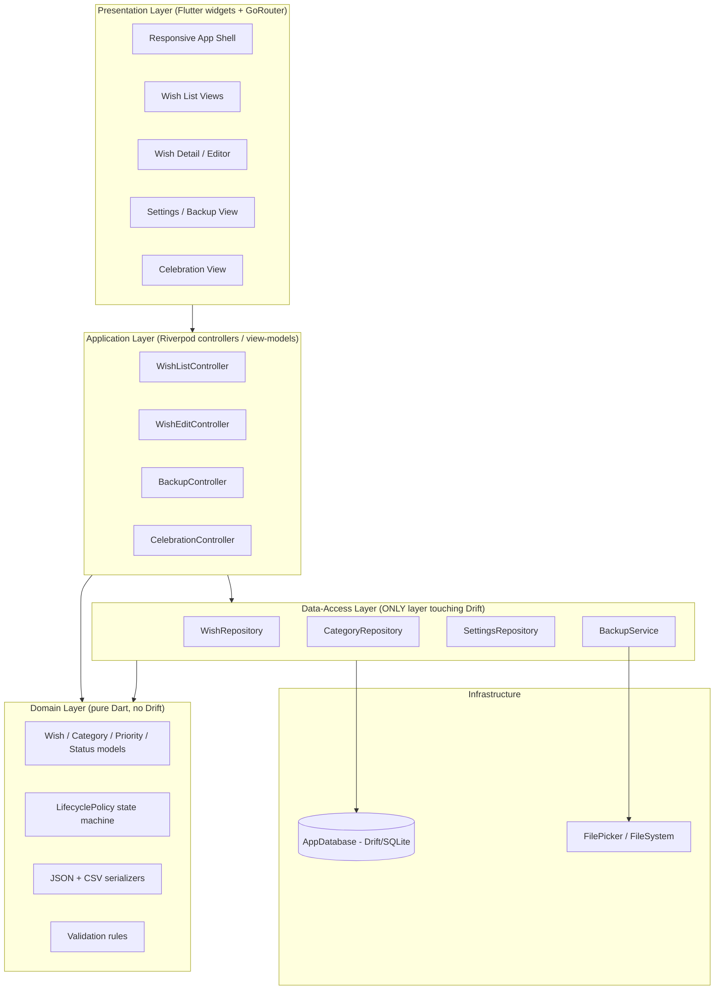
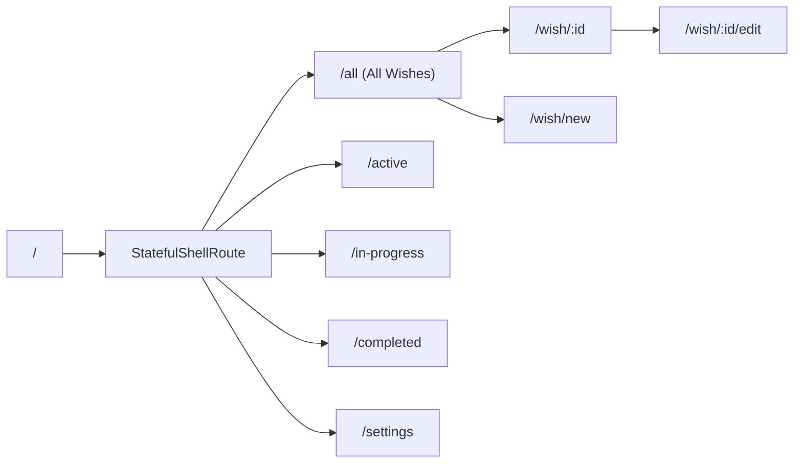
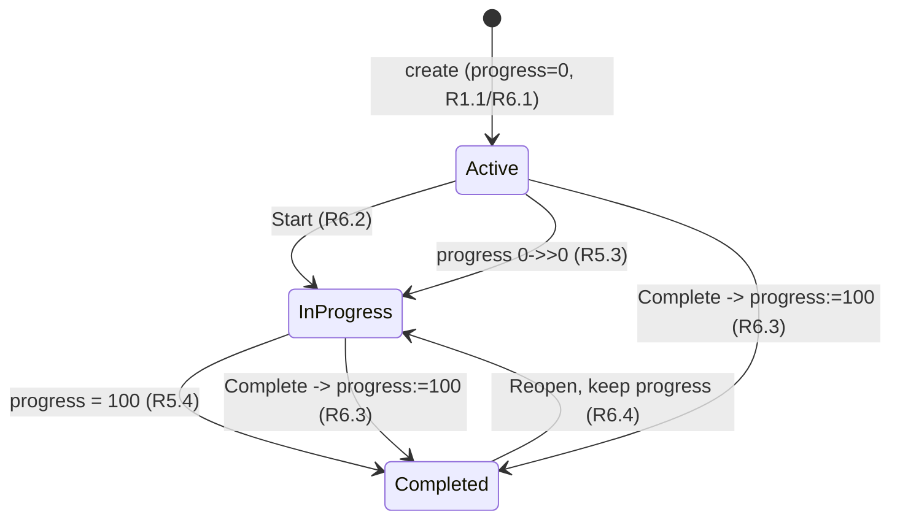

# Design Document

## Overview

Wishable is a cross-platform, local-first personal wishlist and achievement tracker built from a single Flutter/Dart codebase targeting web, Windows, macOS, Linux, Android, and iOS. V1 has no backend, no accounts, and no hosted database: every installation owns an independent SQLite database managed by Drift. The application provides full offline CRUD over Wishes, a lifecycle state machine (Active → In_Progress → Completed with a reopen path), categorization, prioritization, progress tracking, a completion celebration, and manual backup/restore via database, JSON, and CSV export/import.

The design is organized around a strict layering discipline whose central rule is Requirement 14.3: **no feature touches Drift directly**. All persistence flows through a repository-shaped data-access layer. This layer is simultaneously the mechanism that keeps the UI testable and the seam through which a future V2 can introduce cloud synchronization without a rewrite. To make that future viable, every Wish carries a stable UUID and UTC creation/last-modified timestamps from day one (Requirement 14.1, 14.2).

### Design Goals and Rationale

| Goal                               | Driver     | Design response                                                                   |
| ---------------------------------- | ---------- | --------------------------------------------------------------------------------- |
| Local-first, zero backend          | R10, R14.4 | Drift + SQLite per install; no network code paths                                 |
| Single codebase, six platforms     | R13.1      | Drift core API with conditional database opener; Material 3 responsive shell      |
| Future cloud sync without rewrite  | R14        | Repository seam, UUID PKs, UTC timestamps, soft identity model                    |
| Correct, reversible backup/restore | R11, R12   | Transactional import, atomic export with cleanup, round-trip-verified serializers |
| Rewarding completion               | R7         | Lifecycle-driven celebration event emitted by the domain layer                    |

### Technology Stack

- **Framework:** Flutter + Dart (single shared codebase).
- **Persistence:** [Drift](https://drift.simonbinder.eu/) over SQLite. Native platforms use `NativeDatabase` from `package:drift/native.dart`; web uses `WasmDatabase` from `package:drift/wasm.dart` (sqlite3 compiled to WASM, persisted via OPFS with an IndexedDB fallback). Platform selection is handled by a single conditional-import opener so the rest of the code is platform-agnostic ([Drift supported platforms](https://drift.simonbinder.eu/platforms/)). Content was rephrased for compliance with licensing restrictions.
- **State management:** [Riverpod](https://riverpod.dev/) — providers expose repositories and view-model controllers; UI watches derived state.
- **Navigation:** [GoRouter](https://pub.dev/packages/go_router) — declarative routes with a `StatefulShellRoute` for the persistent lifecycle-tab shell.
- **UI:** Material 3 components with Material Symbols icons (R13.4).
- **File I/O:** `file_picker` for cross-platform open/save dialogs (web download/upload, native save dialogs) ([file_picker](https://pub.dev/packages/file_picker)), with `path_provider` for native temp/working directories.

## Architecture

### Layered architecture

Wishable uses a four-layer architecture. Dependencies point strictly downward; the only component permitted to reference Drift types is the data-access layer.



**Rationale.** The repository boundary (R14.3) means controllers and widgets depend on abstract repository interfaces, never on `AppDatabase` or Drift-generated classes. In V1 the implementation is Drift-backed; in V2 the same interfaces can be fronted by a sync-aware implementation (local write + outbox) without changing a single widget. Domain types are plain Dart so they are trivially unit- and property-testable and can be reused by the serializers.

### Module boundaries

| Layer        | May depend on                          | May NOT depend on              |
| ------------ | -------------------------------------- | ------------------------------ |
| Presentation | Application, Domain (read-only models) | Data, Drift, dart:io           |
| Application  | Domain, Data (via interfaces)          | Drift generated types directly |
| Domain       | Dart core only                         | Flutter, Drift, dart:io        |
| Data-Access  | Domain, Drift, file I/O                | Presentation, Application      |

### Platform strategy for persistence

A single `openConnection()` function is selected at compile time via conditional imports:

```dart
// connection/connection.dart
import 'unsupported.dart'
    if (dart.library.io) 'native.dart'   // NativeDatabase (desktop + mobile)
    if (dart.library.js_interop) 'web.dart'; // WasmDatabase (OPFS/IndexedDB)
```

- **Native (Windows/macOS/Linux/Android/iOS):** `NativeDatabase.createInBackground(file)` where `file` lives under the app documents directory from `path_provider`. Recent `sqlite3` bundles SQLite automatically; no extra native libs are required ([Drift platforms](https://drift.simonbinder.eu/platforms/)). Content was rephrased for compliance with licensing restrictions.
- **Web:** `WasmDatabase.open(...)` loading `sqlite3.wasm` and a drift worker; Drift chooses the best available browser storage (OPFS when available, IndexedDB otherwise). The required `sqlite3.wasm` and `drift_worker.js` assets are shipped in `web/`.

The rest of the codebase sees one `AppDatabase` type regardless of platform, satisfying R13.1 while isolating R10 (local persistence) behind the data layer.

### Navigation structure (GoRouter)



A `StatefulShellRoute.indexedStack` preserves per-tab scroll/filter state across the four lifecycle list views (R9.1–R9.4). Detail (R9.5), editor (R1, R2), new-wish, and settings (R11, R12) are routed children. The Celebration View (R7) is presented as a modal overlay above the current route so dismissing it returns the user to the originating view (R7.2).

## Components and Interfaces

### Data-Access Layer (repositories)

All repositories are expressed as abstract interfaces in the domain/data boundary and implemented by Drift-backed classes. Features depend only on the interfaces.

```dart
abstract interface class WishRepository {
  Future<Wish> create(WishDraft draft);          // R1
  Future<Wish> update(WishId id, WishEdit edit);  // R2
  Future<void> delete(WishId id);                 // R8
  Future<Wish?> getById(WishId id);               // R9.5
  Stream<List<Wish>> watchAll();                  // R9.1
  Stream<List<Wish>> watchByStatus(LifecycleStatus status); // R9.2-9.4, R6.5
  Stream<List<Wish>> watchByCategory(CategoryId id);        // R3.4
  Future<Wish> applyProgress(WishId id, int progress);      // R5
  Future<Wish> transition(WishId id, LifecycleEvent event); // R6
  Future<List<Wish>> getAll();                    // export snapshot (R11)
  Future<void> replaceAll(List<Wish> wishes);     // import restore (R12.1)
}

abstract interface class CategoryRepository {
  Future<List<Category>> getAll();                // R3
  Future<Category> getOrCreateByName(String name);// R3.3
  Stream<List<Category>> watchAll();
}

abstract interface class SettingsRepository {
  Future<AppSettings> load();                     // R10.1
  Future<void> save(AppSettings settings);
}

abstract interface class BackupService {
  Future<ExportResult> exportDatabase(ExportTarget t); // R11.1
  Future<ExportResult> exportJson(ExportTarget t);     // R11.2
  Future<ExportResult> exportCsv(ExportTarget t);      // R11.3
  Future<ImportPreview> inspect(ImportFile file);      // R12.2 validation
  Future<void> restore(ImportFile file);               // R12.1 (transactional)
}
```

**Interface rationale.** Mutating operations return the resulting `Wish` so controllers can react (e.g. detect a transition to `Completed` and fire the celebration) without a second read. Read operations are exposed as `Stream`s backed by Drift's reactive `.watch()`, so list views auto-refresh when the database changes. `getAll`/`replaceAll` give the `BackupService` a Drift-free view of the data for serialization and restore.

### Domain Layer

- **`Wish`, `Category`, `AppSettings`** — immutable value objects with `copyWith`.
- **`LifecyclePolicy`** — a pure state machine (see State Machine section) that computes the next `(status, progress)` from a current state plus an event. It contains no I/O and is the single source of truth for all lifecycle rules (R5.3, R5.4, R6).
- **`WishValidator`** — enforces title-non-empty (R1.2, R2.2), priority-set membership (R4.3), and progress bounds 0–100 (R5.2).
- **`WishJsonCodec` / `WishCsvCodec`** — pure serializer/parser pairs used by export/import, designed for round-trip equivalence (R12.4, R12.5).

### Application Layer (Riverpod)

| Controller              | Responsibility                                                               | Requirements   |
| ----------------------- | ---------------------------------------------------------------------------- | -------------- |
| `WishListController`    | Watches repository streams per view, applies sort/filter                     | R4.2, R6.5, R9 |
| `WishEditController`    | Validates and persists create/edit; surfaces title/priority errors           | R1, R2, R4     |
| `WishActionController`  | Progress updates, lifecycle transitions, delete-with-confirmation            | R5, R6, R8     |
| `CelebrationController` | Listens for `→Completed` transitions and raises a celebration event          | R7             |
| `BackupController`      | Drives export targets and import/restore with confirmation + error surfacing | R11, R12       |

### Presentation Layer

- **Responsive shell** — a `LayoutBuilder` switches between a bottom `NavigationBar` (width ≤ 600 px, single column, R13.2) and a `NavigationRail` with a two-pane list/detail layout (width > 600 px, R13.3). All components are Material 3 with Material Symbols icons (R13.4).
- **List views** — one per lifecycle status plus "all", each bound to `WishListController`.
- **Detail / Editor** — full details (R9.5) and create/edit forms with inline validation.
- **Celebration View** — modal overlay showing "Wish fulfilled" and the completed Wish's title (R7.1, R7.3), dismissible back to origin (R7.2).
- **Settings View** — export buttons, import picker, destructive-action confirmation dialogs (R11, R12.3).

## Data Models

### Domain model

```dart
enum LifecycleStatus { active, inProgress, completed }
enum Priority { low, medium, high }

sealed class LifecycleEvent {}
class StartEvent extends LifecycleEvent {}        // Active -> In_Progress (R6.2)
class CompleteEvent extends LifecycleEvent {}      // -> Completed, progress=100 (R6.3)
class ReopenEvent extends LifecycleEvent {}        // Completed -> In_Progress (R6.4)
class ProgressChanged extends LifecycleEvent { final int value; } // R5.3, R5.4

class Wish {
  final String id;              // UUID v4, stable (R14.1)
  final String title;           // non-empty (R1.2)
  final String? description;    // optional (R1.3)
  final String categoryId;      // FK -> Category (R3.1)
  final Priority priority;      // default Medium (R1.4)
  final LifecycleStatus status; // default Active (R1.1)
  final int progress;           // 0..100 (R5)
  final DateTime createdAtUtc;  // UTC (R1.5, R14.2)
  final DateTime updatedAtUtc;  // UTC (R2.4, R14.2)
}

class Category {
  final String id;              // UUID
  final String name;            // unique by name (R3.3)
  final bool isPreset;          // Learn/Travel/Buy/Save/Achieve (R3.2)
}
```

**Timestamp policy.** All timestamps are stored and compared in UTC. This removes timezone ambiguity for the future V2 last-writer-wins / merge logic and makes round-trip equivalence well-defined across platforms and locales (R14.2).

### Drift schema

```dart
class Wishes extends Table {
  TextColumn get id => text()();                              // UUID PK (R14.1)
  TextColumn get title => text().withLength(min: 1)();        // R1.2
  TextColumn get description => text().nullable()();
  TextColumn get categoryId => text().references(Categories, #id)();
  IntColumn get priority => intEnum<Priority>()();            // R4
  IntColumn get status => intEnum<LifecycleStatus>()();       // R6
  IntColumn get progress => integer()();                      // CHECK 0..100
  DateTimeColumn get createdAtUtc => dateTime()();            // R1.5, R14.2
  DateTimeColumn get updatedAtUtc => dateTime()();            // R2.4, R14.2
  @override Set<Column> get primaryKey => {id};
}

class Categories extends Table {
  TextColumn get id => text()();
  TextColumn get name => text().unique()();                  // R3.3
  BoolColumn get isPreset => boolean().withDefault(const Constant(false))();
  @override Set<Column> get primaryKey => {id};
}

class Settings extends Table {
  TextColumn get key => text()();
  TextColumn get value => text()();                          // R10.1
  @override Set<Column> get primaryKey => {key};
}
```

A `progress` CHECK constraint (0–100) and the `title` length constraint provide a defense-in-depth backstop; validation in the domain layer is the primary gate (R5.2, R1.2). Preset categories are seeded in the Drift migration's `onCreate` (R3.2).

### Serialization formats

**JSON_Export** — an object with a schema version and a `wishes` array. Each wish serializes all domain fields; timestamps are ISO-8601 UTC strings; enums serialize as stable lowercase tokens (`active`, `in_progress`, `completed`, `low`, `medium`, `high`). Categories are embedded by name so an import on a fresh install can recreate them.

```json
{
  "schemaVersion": 1,
  "exportedAtUtc": "2025-01-01T00:00:00.000Z",
  "wishes": [
    {
      "id": "…uuid…",
      "title": "Learn to sail",
      "description": null,
      "category": "Learn",
      "priority": "medium",
      "status": "in_progress",
      "progress": 40,
      "createdAtUtc": "2025-01-01T00:00:00.000Z",
      "updatedAtUtc": "2025-01-02T00:00:00.000Z"
    }
  ]
}
```

**CSV_Export** — a header row followed by one row per Wish with the same fields in a fixed column order. CSV is written with RFC-4180 quoting (fields containing commas, quotes, or newlines are quoted; embedded quotes are doubled) so that titles/descriptions with special characters survive a round trip. Enum tokens and ISO-8601 UTC timestamps match the JSON encoding.

**Equivalence definition.** Two sets of Wishes are _equivalent_ when they contain the same wishes compared by all domain fields (`id`, `title`, `description`, `category name`, `priority`, `status`, `progress`, `createdAtUtc`, `updatedAtUtc`), independent of ordering. This definition grounds the round-trip properties (R12.4, R12.5).

### Wish lifecycle state machine

The `LifecyclePolicy` is a pure function `(LifecycleStatus, int progress, LifecycleEvent) -> (LifecycleStatus, int progress)`. It is the only place lifecycle rules live, so every mutation path (explicit transition buttons, progress slider, mark-complete, reopen) obeys the same invariants.



Transition rules enforced by `LifecyclePolicy`:

| Current status       | Event                         | Next status | Progress effect   |
| -------------------- | ----------------------------- | ----------- | ----------------- |
| Active               | Start                         | In_Progress | unchanged         |
| Active / In_Progress | ProgressChanged(p), 0→p>0     | In_Progress | p                 |
| any                  | ProgressChanged(100)          | Completed   | 100               |
| any                  | Complete                      | Completed   | set to 100 (R6.3) |
| Completed            | Reopen                        | In_Progress | retained (R6.4)   |
| any                  | ProgressChanged(p<0 or p>100) | unchanged   | rejected (R5.2)   |

**Derived invariants** (hold after every transition):

- `status == Completed  ⇔  progress == 100` is _not_ strictly required by requirements, but `status == Completed ⇒ progress == 100` **is** (R6.3, R5.4). Reopen moves to In_Progress while keeping the stored progress (which may be 100), so Completed uniquely implies progress 100 while In_Progress may hold any 0–100 value.
- `progress ∈ [0, 100]` always (R5.1, R5.2).
- `progress > 0 ⇒ status ≠ Active` (R5.3).

## Correctness Properties

_A property is a characteristic or behavior that should hold true across all valid executions of a system — essentially, a formal statement about what the system should do. Properties serve as the bridge between human-readable specifications and machine-verifiable correctness guarantees._

The following properties were derived from the acceptance criteria via prework analysis and reflection. Redundant criteria were consolidated (e.g. all field-persistence criteria into one round-trip; all lifecycle transitions into one state-machine invariant) so each property below provides unique validation value.

### Property 1: Persistence round-trip preserves all fields

_For any_ valid Wish draft, after creating (and optionally editing) the Wish, reading it back by id — including after closing and reopening the Local_Database — yields a Wish equal on every domain field (title, description, category, priority, status, progress, createdAtUtc, updatedAtUtc) to what was written.

**Validates: Requirements 1.1, 1.3, 2.1, 2.3, 3.1, 4.1, 9.5, 10.4**

### Property 2: Title validation rejects blank titles and preserves state

_For any_ string that is empty or consists solely of whitespace, submitting it as a title on create or edit is rejected, no new Wish is persisted on create, and on edit the previously stored Wish is left unchanged.

**Validates: Requirements 1.2, 2.2**

### Property 3: Default priority is Medium

_For any_ Wish draft that does not specify a Priority, the created Wish has Priority `Medium`.

**Validates: Requirements 1.4**

### Property 4: Timestamps are recorded in UTC with correct ordering

_For any_ Wish, creation records a UTC createdAtUtc, every update records a UTC updatedAtUtc, and updatedAtUtc is never earlier than createdAtUtc.

**Validates: Requirements 1.5, 2.4, 14.2**

### Property 5: Category get-or-create is idempotent

_For any_ category name, the first get-or-create produces a stored Category, and any subsequent get-or-create with the same name returns the same Category id without creating a duplicate.

**Validates: Requirements 3.3**

### Property 6: Filtering is sound and complete

_For any_ set of Wishes and any filter predicate (by Category, by Lifecycle_Status, or "all"), the returned list contains every Wish that satisfies the predicate and no Wish that does not.

**Validates: Requirements 3.4, 6.5, 9.1, 9.2, 9.3, 9.4**

### Property 7: Priority sort is an ordered permutation

_For any_ set of Wishes, sorting by Priority produces a permutation of the input (same multiset of Wishes) in non-increasing Priority order from `High` to `Low`.

**Validates: Requirements 4.2**

### Property 8: Progress bounds are enforced

_For any_ integer p, applying p as a Progress_Value persists it when 0 ≤ p ≤ 100 and rejects it while retaining the previously stored Progress_Value when p < 0 or p > 100.

**Validates: Requirements 5.1, 5.2**

### Property 9: Lifecycle state machine preserves its invariants

_For any_ Wish and any sequence of lifecycle events (Start, ProgressChanged, Complete, Reopen), the resulting state satisfies all invariants: a Wish created is `Active` with progress 0; raising progress from 0 to a value greater than 0 yields `In_Progress`; progress 100 or Complete yields `Completed` with progress 100; reopening a `Completed` Wish yields `In_Progress` with its stored progress retained; progress always remains in [0, 100]; and `status == Completed` implies `progress == 100`.

**Validates: Requirements 1.1, 5.3, 5.4, 6.1, 6.2, 6.3, 6.4**

### Property 10: Wish identifiers are unique and stable

_For any_ sequence of Wish creations, all assigned identifiers are distinct, and _for any_ edit of a Wish, its identifier is unchanged.

**Validates: Requirements 14.1**

### Property 11: Completion emits a celebration event carrying the title

_For any_ lifecycle event whose resulting status is `Completed`, a celebration event is emitted exactly once for that transition, and its payload carries the completed Wish's title.

**Validates: Requirements 7.1, 7.3**

### Property 12: Cancelled delete is a no-op

_For any_ set of Wishes, a delete request that the User cancels leaves the Local_Database unchanged.

**Validates: Requirements 8.3**

### Property 13: Confirmed delete removes exactly the target

_For any_ set of Wishes and any chosen Wish, a confirmed delete removes exactly that Wish (getById returns null and it is absent from all views) and leaves every other Wish present.

**Validates: Requirements 8.1**

### Property 14: Export failure cleans up and preserves the database

_For any_ set of Wishes, when an export operation fails after beginning to write, no partial export file remains at the designated location and the Local_Database is left unchanged.

**Validates: Requirements 11.4**

### Property 15: Malformed import is rejected without side effects

_For any_ malformed or unreadable Import_File content, the import is rejected with a descriptive error and the Local_Database is left unchanged.

**Validates: Requirements 12.2**

### Property 16: JSON export/import round-trip equivalence

_For any_ set of Wishes, exporting to a JSON_Export and then importing that JSON_Export produces a set of Wishes equivalent to the original set (equal on all domain fields, independent of ordering).

**Validates: Requirements 11.2, 12.1, 12.4**

### Property 17: CSV export/import round-trip equivalence

_For any_ set of Wishes — including titles and descriptions containing commas, quotes, and newlines — exporting to a CSV_Export and then importing that CSV_Export produces a set of Wishes equivalent to the original set.

**Validates: Requirements 11.3, 12.1, 12.5**

## Error Handling

| Scenario                                                   | Layer                          | Handling                                                                                                                                                                                      | Requirement  |
| ---------------------------------------------------------- | ------------------------------ | --------------------------------------------------------------------------------------------------------------------------------------------------------------------------------------------- | ------------ |
| Empty/whitespace title on create or edit                   | Domain validator → Application | Reject before persistence; return `TitleRequiredError`; UI shows "A title is required" inline; prior state untouched                                                                          | R1.2, R2.2   |
| Progress out of [0,100]                                    | Domain validator               | Reject; retain stored progress; no status change                                                                                                                                              | R5.2         |
| Invalid priority token on import/parse                     | Domain codec                   | Reject the record (or whole file) with descriptive parse error; stored data unchanged                                                                                                         | R4.3         |
| Export write failure (disk full, permission, cancelled)    | BackupService                  | Catch, delete any partially written file at the target path, surface descriptive message, leave DB unchanged. Export reads from a transactional snapshot so the DB is never mutated by export | R11.4        |
| Malformed / unreadable Import_File                         | BackupService.inspect          | Validate fully before any write; on failure reject with descriptive error and do not open a write transaction                                                                                 | R12.2        |
| Restore replacing existing data                            | BackupController               | Require explicit confirmation dialog before executing; restore runs inside a single Drift transaction so a mid-restore failure rolls back entirely (DB unchanged)                             | R12.1, R12.3 |
| Delete request                                             | WishActionController           | Require confirmation; cancel is a no-op                                                                                                                                                       | R8.2, R8.3   |
| Database open failure (web OPFS unavailable, corrupt file) | Connection opener              | Fall back to IndexedDB on web; on native surface a recoverable error screen; never silently drop data                                                                                         | R10          |

**Atomicity principles.**

- _Export never mutates._ Exports read a consistent snapshot and write to a temp path, then move into place; failure deletes the temp file (R11.4).
- _Import is all-or-nothing._ Validation precedes mutation; the actual `replaceAll` runs in one transaction, so malformed or mid-restore failures leave the database exactly as it was (R12.1, R12.2).

## Testing Strategy

Wishable uses a dual testing approach: property-based tests for universal correctness, example/widget tests for concrete UI behavior and edge cases, and a small set of integration/smoke tests for infrastructure and build concerns.

### Property-based testing

PBT applies strongly here because the serializers (round-trip — the canonical PBT target), the lifecycle state machine (invariants), validation (error conditions), and filtering/sorting (metamorphic/invariant) are all pure logic with large input spaces.

- **Library:** `package:fast_check` style is not idiomatic in Dart; use the Dart property-testing library (e.g. `glados`, or `dart_test` with a generator helper). Do **not** hand-roll a PBT engine.
- **Iterations:** each property test runs a minimum of 100 generated cases.
- **Generators:** a `Wish` generator produces random valid wishes (random titles including Unicode/special characters, optional descriptions with commas/quotes/newlines for the CSV property, random category names, priorities, statuses consistent with the state machine, progress in [0,100], UTC timestamps). A separate "blank string" generator (empty + whitespace variants) feeds the validation property, and an "out-of-range int" generator feeds the progress-bounds property.
- **Tagging:** each property test is annotated with a comment of the form
  `// Feature: wishable, Property {number}: {property_text}`
  and references the design property it implements. Each of Properties 1–17 is implemented by exactly one property-based test.

Mapping of properties to the units under test:

| Property     | Unit under test                                     | Notes                                         |
| ------------ | --------------------------------------------------- | --------------------------------------------- |
| 1, 4, 10, 13 | `WishRepository` (in-memory Drift)                  | NativeDatabase.memory() for fast, isolated DB |
| 2, 3, 8      | `WishValidator` / draft construction                | pure                                          |
| 5, 6, 7      | repository query logic + sort helper                |                                               |
| 9            | `LifecyclePolicy`                                   | pure state machine                            |
| 11           | `CelebrationController` + policy                    | event emission                                |
| 12, 14, 15   | `BackupService` with injected failing/malformed I/O |                                               |
| 16, 17       | `WishJsonCodec`, `WishCsvCodec`                     | round-trip over generated sets                |

### Example and widget tests

- **R1.3** optional-field assignment; **R3.2** five preset categories seeded on fresh DB.
- **R7.2** celebration dismiss restores prior route; **R8.2** delete triggers confirmation; **R12.3** replace-restore prompts confirmation.
- **R13.2 / R13.3** responsive layout at representative widths (e.g. 360, 600, 601, 1200) asserting single-column vs rail/multi-column.
- **R9.5** detail view renders all fields; celebration view (R7.1) renders "Wish fulfilled" and the title (R7.3).

### Integration and smoke tests

- **R11.1** database export: export the file, open the copy, assert equivalent wishes + settings (1–2 examples).
- **R10.1 / R10.4** durability: write data, reopen the database, assert data present (also covered by Property 1).
- **R10.2** CRUD succeeds with no network dependency; **R10.3 / R14.4** no account/server/hosted-DB dependency compiled in.
- **R13.4** `ThemeData.useMaterial3` true and Material Symbols icon set configured.
- **R13.1** CI builds succeed for all six target platforms.

### Architecture test (R14.3)

A source-level test asserts that no file under the presentation or application layers imports `package:drift/...` or the generated database directly — enforcing the data-access boundary that is the V2 cloud-sync seam.

### Why PBT is scoped as above

Infrastructure and configuration criteria (R10.2, R10.3, R13.1, R13.4, R14.3, R14.4) are verified by smoke/architecture tests rather than property tests because their behavior does not vary with input. The database-file export (R11.1) is an integration test for the same reason. Everything with a meaningful "for all inputs" statement — serialization, lifecycle, validation, filtering, sorting, identity, cleanup — is covered by Properties 1–17.
